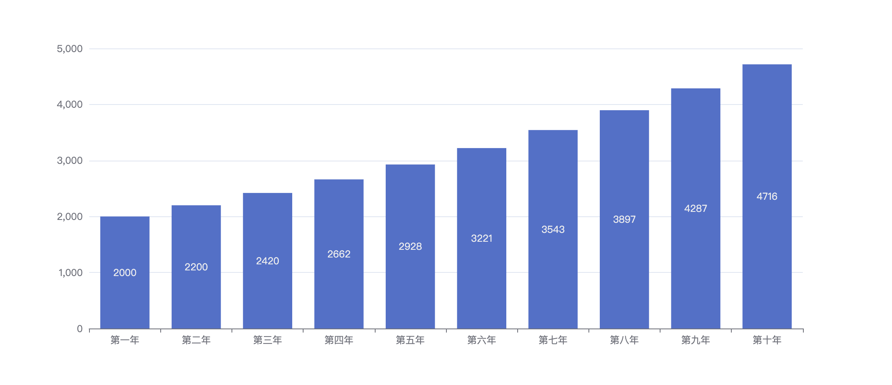
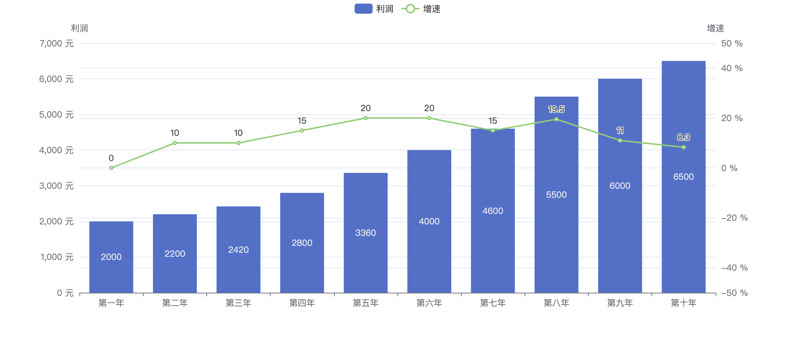
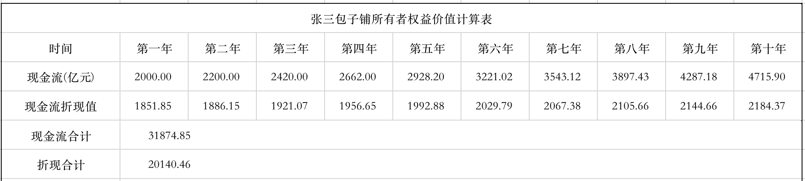
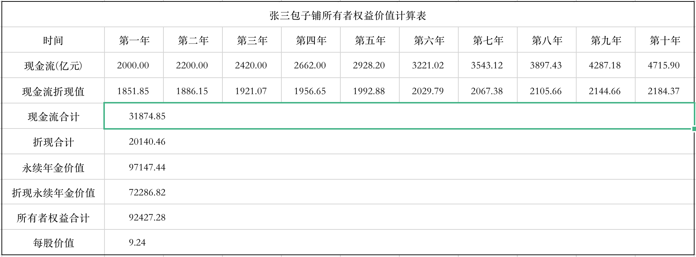
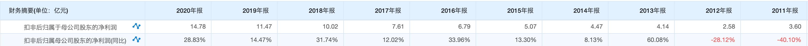
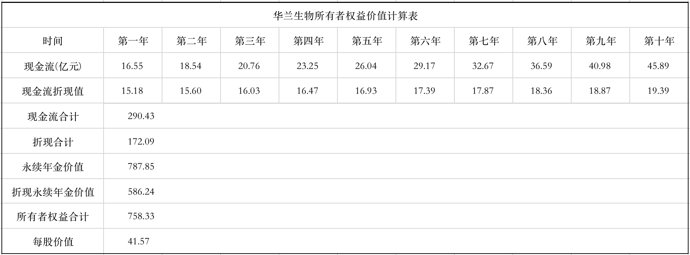

> 股票的价值等于它未来现金流的折现值，不多也不少。

## 投资股票赚的是什么钱？

**股票投资赚的只有两种钱，一种是企业增长的钱，一种是股价波动的钱。**怎么理解这句话呢？这里我举一个简单且不严谨的栗子，你有一个朋友叫张三，他在一家早餐店干了一年多，收入微薄准备回到老家，在镇子上开家包子铺。他仔细核算了一下成本发现包子铺开起来需要 10000 元人民币的成本，但他手里只有 5000 元，由于已经出来工作了所以他并不想让家人帮忙。于是他想到了你，他把创业计划和你详细的说了一遍，他以技术折算 30% 的股份加上 5000 元的资本投入共计拥有这家包子铺 65% 的股份，你以 5000 元的资本投入获得 35% 的股份，这笔投资你同意了。



这家包子铺经营了三年后，你开始计算投资收益，第一年扣非利润是 2000 元人民币，且之后一直保持 10% 的增幅。所以第一年你获得了 700 元的收益，假如包子铺经营不会发生变化，你预测到第十年包子铺共带来 31875 元左右的收益；其中你将获得 11156 元左右的收益，这笔投资十年内为你带来了 123 % 的收益，**而这赚的就是企业增长的钱**。



包子铺又经营了两年将价格涨了两次，由于张三做的包子口感非常好，所以镇上很多人都乐意来这里买包子，即便包子价格比其他包子铺贵一点也不介意。两次涨价分别让利润实现了 15% 以及 20% 的涨幅，这五年包子铺一共给你带来了 4473 元的收益，基本上已经收回了成本。这时李四和王五也看好张三包子铺的盈利能力，他们找上你希望获得你手中的股份，并且愿意给与一定的溢价。你们商讨了一天，李四最后出价以包子铺当前收益 20 % 的增速计算之后十年时间总利润也就是 105000 元左右，以 36750 元的价格获取你手中 35% 的股份。而王五在李四出价的基础上加价 20% 最后给出 44000 元价格，你认为镇子的市场就那么大，包子铺的收益不可能一直保持高增长，所以你同意了王五的交易以 4.4 W 卖出了所有股份。

果然和你预测的一样，包子铺虽然在第六年保持了 20 % 的利润增幅，但随着竞争对手开始改良口味，后面几年包子铺的收益开始收窄。第六年到第十年所带来的实际总收益是 26600 元，而你之前的股份所带来的收益是 9310 元，**这里赚的就是股价波动的钱**。之所以价格会有波动是因为增量资金导致的，买方变多就会导致股票抬高价格，现实的股票交易市场也和这个栗子类似，但实际情况更为复杂。

## 如何给公司定价？

我目前知道的估值方法有两类，一类是相对估值法，另一类是绝对估值法。

### 相对估值

相对估值用市盈率、市销率、市净率等指标与其他股票进行对比。这里我们用市盈率来举例，它有个很简单的公式，**股价 = 每股利润 × 市盈率**，这个市盈率是什么，其实就是公司去年收益的倍数。已经知道的看官直接看后面的内容，这里举个简单的栗子：拿前面张三的包子铺来说，第三年它的收益是 2420 元，假如这时候李四想要入股，那么怎么算它值多少钱呢。2420 元？肯定不可能，因为包子铺它还会继续产生收益，而且收益还在继续增大，傻子才会按利润卖给你。那怎么办？这时李四想到上市公司也有个做包子生意的公司叫巴比食品，目前这家公司的市盈率是 30 倍左右。张三的包子铺还没上市，所以需要打点折扣就 25 倍市盈率吧，所以目前张三的包子铺的估值就是 2420 * 25 = 60500 元。之前张三开包子铺的时候一共筹集了 10000 元，假如按当时一元一股共计是 10000 股，那么现在的每股的股价就是 60500 / 10000 = 6.05 元。简单来说相对估值就是按已经上市的类似的公司做参照给与的一个估值倍数，这里有个问题假如市场上没有相同的公司呢？另外虽然是相同行业的公司但由于赚钱的能力有差别也不能完全参照。或者你有其他的朋友有个创业的想法找你融资你该怎么去估值呢？这里我们就引出了下面的绝对估值法。

### 绝对估值

绝对估值法指通过对公司历史及当前基本面的分析和对未来公司经营状况的预测获得公司的内在价值。它有这些类型，现金流贴现模型，股息贴现模型。我们今天要讲的就是未来现金流贴现。

## 未来现金流贴现

投资的本质是赚取企业增长的钱，而企业的收益最终体现在其赚钱能力上，也就是其获取现金流的能力。从包子铺的栗子我们可以发现，张三花钱开店然后生产包子，再卖出给消费者获取现金，其本质就是从现金到产品再到现金的一个循环的过程。所以我们可以通过对企业基本面的分析，以及对公司未来所能获取的现金流推算出企业的实际价值。**请注意，内在价值的估算一定是在公司基本面分析后的事情，如果这家公司财务造假，那么我们测算的内在价值将毫无意义，所以你要先判断企业的质量。** 要想估算公司的内在价值，首先我们要弄明白几样东西，**自由现金流，现值，折现率，永续年金**。

#### 自由现金流

自由现金流就是企业在扣除成本费用，税费以及其他损益之后的钱，一般在财务报表上体现为扣非净利润。自由现金流是增加和减少不会损害公司经营的资金，企业可以用分红等方式为股东创造利润。

#### 现值

现值是一笔钱现在的价值，比如同样是 100 元人民币，它现在的价值就大于一年以后的价值。因为这笔钱我们还可以拿去投资，比如 10 年期国债这个几乎无风险的产品其收益率是 3% 左右，一年以后这笔钱就变成了 103 元，所以一年后的 103 元才等于现在的 100 元。我们要记住一点**未来的现金流一定是没有现在的现金流值钱的**。

#### 折现率

现在的现金我们可以拿去投资，但投资可能会造成这笔现金永远无法收回的可能，所以我们要为这种风险做出补偿，这也就是“风险溢价”。没有那种投资像国债这样能带来确定的现金流，所以折现率就等于国债利率加上风险溢价。那么我们怎么确定风险溢价应该给多少呢？这要结合自己对公司质量的评估，公司的经营风险越高它的风险溢价也就越高。我个人定的是 5% 上下 3 个点浮动，所以我的折现率是 3 + (5 ± 3)，也就是最终折现率在 5%  到 11%之间，但一般使用 8 % ~ 10% 的折现率。

#### 计算现值


我们已经知道投资是为了获取未来的现金流，也知道了折现率怎么定义，就可以测算未来现金流的现在价值。我们看上面的公式，CFₙ 表示第 N 年的现金流，R 表示折现率，假如折现率是 5% 那么三年后的 100 元等于现在多少钱呢？一年后 100 元这样计算 100 / (1 + 0.05) 也就是 95 元；两年后是 100 / 1.05²  = 91 元，三年后则是86 元。



继续使用包子铺的栗子，算一下包子铺未来十年产生的现金流折合现在的多少钱，你发现镇上的包子铺就一家但口味很一般，所以你认为张三的包子铺很有竞争力，所以你给了一个 2% 的风险溢价加上国债利率，最后给出 5% 的折现率。第一年产生的现金流是 2000 元，折现值是 2000 / 1.05 = 1905 元；第二年产生 2200 元的现金流，折现值是 2200 / 1.05²  也就是 2200 / 1.1 = 1995 元；以此类推第十年的现金流是 4716 元它的折现值是 2895 元。最后统计张三的包子铺十年内产生 31875 的现金流折现到当前值 23693 元，你拥有 35% 的股份的收益是 8292 元，而你付出的是 5000 元，所以这笔投资是划算的。

#### 永续年金价值

从前面包子铺的图上我们发现，它每年产生的现金流都比上一年增长10%，但这种增长是不会永远保持的。影响包子铺收益的有两点，包子铺的销量以及每个包子的价格，买包子的人数达到极限后销量就不会再增加，甚至可能出现下滑；随便涨价否则客户可能改买别的早点。所以虽然包子铺理论上可以无限期经营，但现金流增长率不能保持之前的高速，现金流的增长率达到极限后会维持一个很低的增长率，用永续年金价值（PV）来表示这种情况。计算永续年金价值最普通的方法就是拿你估计的最后的现金流 (CF)，按照你期望的现金流长期增长率(g)，用折现率(R)减去长期预期增长率的结果去除，它的计算公式如下所示。


继续使用包子铺来举例，第十年包子铺现金流是 4716 元，我们假设它之后的长期增长率等于国债利率 3%，并且假设折现率是 10%。我们来算一下，首先计算第十一年的现金流 4716 * 1.03 = 4857.5 元，然后用 4857.5 元 去除 0.07 (折现率减去长期增长率) 最后得到 69393 元的永续年金价值。套用公式来计算如下图。


#### 计算所有者权益价值

```shell
第一步：预测未来十年的现金流 (FCF)
第二步：把这些未来现金流折现成现值。
			▸折现 FCF = 当年的 FCF ÷ (1+R)ⁿ。（这里 R 表示折现率，n 表示年份）
第三步：计算永续年金的价值并把它折现成现值。
			▸永续年金价值 = FCF₁₀ × (1 + g) ÷ (R - g)
			▸折现永续年金价值 = 永续年金价值 ÷ (1 + R)¹⁰
第四步：折现永续年金价值加上 10 年折现现金流计算全部所有者权益。
			▸所有者权益价值合计 = 永续年金折现价值 + 10 年折现现金流
第五步：所有者权益价值合计除以股份数计算每股价值
			▸每股价值 = 所有者权益价值合计 ÷ 股份数量
```

这些步骤看着还是有点不太明白啊，没关系我们用两个栗子来学习，一个计算包子铺，一个用上市公司华兰生物来计算。**请注意这里只是为了举例说明，不构成任何投资建议**。

#### 计算包子铺每股内在价值

 现在根据现金流贴现完整步骤计算一下包子铺每股值多少钱，假设包子铺一共有 10000 股的份额，它的长期增长率是 3%，折现率是 8 % 和上面的不一样哦。

- 第一步预测第一年现金流是 2000 元，并且每年按 10% 递增，第二年是 2000 × 1.1 =  2200 元，以此类推到第十年是 4716 元，合计 10 年现金流是 31875 元。
- 第二步计算未来十年的现金流的折现值，第一年是 2000 ÷ 1.08 = 1852，以此类推到第十年现金流 2184 元，十年现金流折现值合计是 20140 元。
- 第三步先计算永续年金，用第十年现金流 × (1 + g) ÷ (R - g) ，即 4716 × 1.03 ÷ 0.05 = 97147 元。然后计算它的折现值 97147 ÷ (1 + R)¹⁰ ，即 97147 ÷ 1.344 = 72286 元。
- 第四步计算所有者权益合计 72286 + 20140 = 92426 元 （和表格有偏差是因为小数点导致）
- 计算每股价值 92426 ÷ 10000 = 9.24 元。

 根据现金流贴现估值你计算出包子铺每股值 9.24 元，你出资 5000 元拥有 3500 股，也就是每股付出了大约 1.43 元人民币，假如这个预算能够实现，十年后这笔投资你获得了 546% 的投资收益。



#### 计算华兰生物每股内在价值



怎么假设华兰生物未来十年的增长率呢，先计算 2011 到 2020 年所有增长，但 11 年和 12 年是华兰生物唯一两年现金流增长为负数的，所以直接统计不太准，所以去掉一个最高和一个最低，得出 14.25 的平均增长率，再打八五折最后得出 12 % 的现金流增长率。它的长期增长率是 3%，折现率是 9 %。

- 第一步预测第一年现金流是 16.55 亿元，并且每年按 12% 递增，第二年是 16.55 亿元 × 1.12 =  18.54 亿元，以此类推到第十年是 45.89 亿元，合计 10 年现金流是 290.43 亿元。
- 第二步计算未来十年的现金流的折现值，第一年是 16.55 ÷ 1.09 = 15.18 亿元，以此类推到第十年现金流 19.39 亿元，十年现金流折现值合计是 172.09 亿元。
- 第三步先计算永续年金，用第十年现金流 × (1 + g) ÷ (R - g) ，即  45.89 亿元 × 1.03 ÷ 0.06 = 787.85 亿元。然后计算它的折现值 787.85 亿元 ÷ (1 + R)¹⁰ ，即 787.85 亿元 ÷ 1.344 = 586.24 亿元。
- 第四步计算所有者权益合计 586.24 亿元 + 172.09 亿元 = 758.33 亿元 （和表格有偏差是因为小数点导致）
- 计算每股价值 758.33 亿元 ÷ 18.24亿股 = 41.57 元。



## 最后

股票投资赚的只有两种钱，一种是企业增长的钱，一种是股价波动的钱。波动是因为买卖双方的一些行为导致的，但人的行为是无法预测的，比如国家放水，比如某些政策政策或是某些故事，当然实际情况更复杂，所以预测什么时候开始上涨很难。相比波动企业的未来现金流是相对可预测的，根据未来现金流折现就能计算出每股的内在价值，而我们在内在价值上打一个折扣买入就是低买，而在内在价值之上卖出就是高卖。

